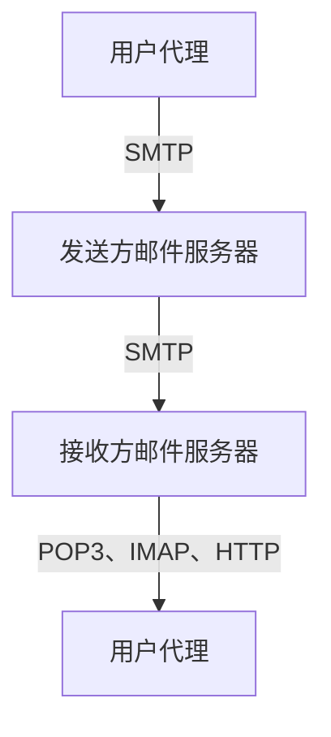

## EMail
---

- 三个主要组成部分：
	- 用户代理
	- 邮件服务器
	- 简单邮件传输协议：SMTP

### 用户代理

- 又名“邮件阅读器”
- 撰写、编辑和阅读邮件
- 如Outlook、Foxmail等
- 输出和输入邮件保存在服务器上

### 邮件服务器

- 邮箱中管理和维护发送给用户的邮件
- 输出报文队列保持待发送的邮件报文
- 邮件服务器之间的SMTP协议：发送email报文
	- 客户：发送方邮件服务器
	- 服务器：接收端邮件服务器

### SMTP协议

- RFC 2821
- 使用TCP在客户端和服务器之间传送报文，端口号为25
- 直接传输：从发送方服务器到接收方服务器
- 传输的三个阶段：
	- 握手
	- 传输报文
	- 关闭
- 命令/响应交互
	- 命令：ASCII文本
	- 响应：状态码和状态信息
- 报文必须为七位ASCII码
- 使用持久连接
- SMTP服务器使用CRLF.CRLF决定报文的尾部

- 与HTTP比较：
	- HTTP：拉（pull）
	- SMTP：推（push）
	- 二者都是ASCII形式的命令/响应交互、状态码
	- HTTP：每个对象封装在各自的响应报文中
	- SMTP：多个对象包含在一个报文中

### 邮件报文格式

- SMTP：交换email报文的协议
- RFC822：文本报文的标准：
	- 首部行，如：
		- To：
		- From：
		- Subject
		- 与SMTP命令不同
	- 空行
	- 主体
		- 报文，只能是ASCII码字符

- 报文格式的扩展
	- MIME[^1]
		- RFC 2045，2056
	- 在报文首部用额外的行申明MIME内容类型
 
 
### 邮件访问协议

- SMTP：传送到接收方的邮件服务器
- 邮件访问协议：从服务器访问邮件
		- POP[^2]：RFC 1939
			- 用户身份确认并下载
		- IMAP[^3]：RFC 1730
			- 更多特性（更复杂）
			- 在服务器上处理存储的报文
		- HTTP：*Hotmail*，*Yahoo! Mail*
			- 方便

- POP3 协议
	- 用户确认阶段：
		- 客户端命令：
			- user：申明用户名
			- pass：口令
		- 服务器响应：
			- OK
			- ERR
	- 事物处理阶段：
		- 客户端：
			- list：报文号列表
			- retr：根据报文号检索报文
			- dele：删除
			- quit：退出
	- 下载并删除模式：
		- 如果改变客户机，邮件就不可再次被阅读
		- 节省邮箱空间
	- 下载并保留模式：
		- 不同客户机上为报文的拷贝
	- POP3在会话中是无状态的
	- 本地管理文件夹

- IMAP
	- IMAP服务器将每个报文与一个文件夹联系起来
	- 允许用户用目录来组织报文
	- 允许用户读取报文组件
	- IMAP在会话过程中保留用户状态：
		- 目录名、报文ID与目录名之间映射
	- 远程管理文件夹

## 名词解释
---

[^1]: MIME: *multimedia mail extension* 多媒体邮件扩展

[^2]: POP: *Post Office Protocol*  邮局访问协议

[^3]: IMAP: *Internet Mail Access Protocol* Internet邮件访问协议