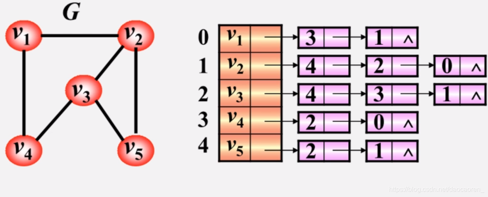

> 树是一种特殊的图，与图的存储方式相同。
> 对于无向图中的边ab，存储两条有向边a->b, b->a。
> 因此我们可以只考虑有向图的存储。

### 邻接矩阵

- g[a] [b]存储边a->b，使用较少

### 邻接表



```cpp
// 对于每个点k，开一个单链表，存储k所有可以走到的点。h[k]存储这个单链表的头结点
int h[N], e[N], ne[N], idx;

// 添加一条边a->b
void add(int a, int b)
{
    e[idx] = b, ne[idx] = h[a], h[a] = idx ++ ;
}

// 初始化
idx = 0;
memset(h, -1, sizeof h);
```

